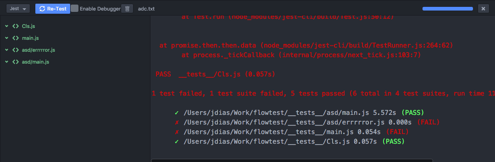

# Jest Test Runner for Nuclide

## What is this?

This is a [Jest](https://facebook.github.io/jest/) test runner for [Nuclide](https://nuclide.io/) and its nuclide-test-runner.

It is loosely based on [nuclide-test-runner-pytest](https://github.com/klorenz/nuclide-test-runner-pytest) and reverse engineering.
[This part](https://github.com/facebook/nuclide/blob/master/pkg/nuclide-test-runner/lib/TestRunnerController.js#L266) helped, along with atom's inspector.

This is my first atom package and nuclide-test-runner's documentation is lacking.
It works though. If you want to help out please do!

## How to install

Install it in an atom instance with nuclide. The package is called `nuclide-test-runner-jest` there.

You can also do it in the console if you prefer:  
`apm install nuclide-test-runner-jest`

## How to use it

Go to menu **Nuclide** > **Test Runner** > **Toggle**  
Make sure Jest is chosen on the test runner drop down  
Press the **Test/Re-test** blue button

Notice that this package assumes:
* the atom project root is the `package.json` root
* the project has `jest-cli` locally installed (aka `npm install --save-dev jest-cli`)

## How does it look

  
by default runs all tests

  
if you're editing a test file, runs only that one

## Limitations

* nuclide-test-runner only fires if you have at least one opened file (can't do anything about this one)
* failed tests aren't properly marked red on the summary view on the left (I believe this is a nuclide-test-runner limitation too)
* stopping tests while they're running doesn't kill jest process (is it reporting back to us that event?)
